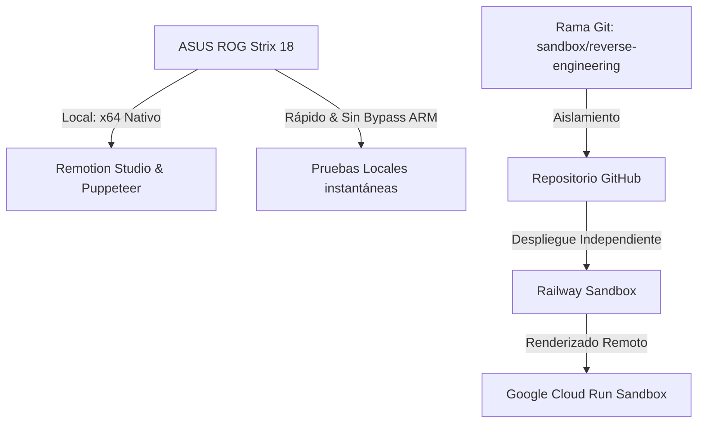

# 🌌 Visión del Proyecto y Estrategia de Ingeniería Inversa
## _Computational Cinematography MVP_

Este documento detalla la visión técnica, arquitectura y estrategia de clonación/ingeniería inversa para el desarrollo y optimización del **Digital Menu Studio** utilizando la nueva estación de trabajo.

---

## ⚡ 1. Visión Tecnológica y de Infraestructura

El objetivo de esta fase de ingeniería inversa es aislar el desarrollo experimental de la rama estable de producción, aprovechando al máximo la nueva infraestructura física (ASUS ROG Strix 18) y lógica (Google Cloud Run + Railway).



### 🖥️ Infraestructura Física: ASUS ROG Strix 18
La migración del desarrollo local a este hardware cambia por completo las reglas del juego:
* **Procesador (Intel Core Ultra 9 2.70GHz):** Permite renderizar múltiples hilos de Puppeteer/Chromium localmente a velocidades récord.
* **GPU (NVIDIA RTX 5070 12GB):** Permite explorar en el futuro renderizado enriquecido por hardware, efectos 3D avanzados y modelos generativos de IA en local.
* **Compatibilidad x64 Nativa:** **Ya no es necesario el bypass de arquitectura para ARM64** (`process.arch = 'x64'`). Puppeteer puede descargar Chromium normal y ejecutar el empaquetado de Remotion de forma nativa sin configuraciones especiales de rutas a Edge.

### 🛡️ Aislamiento Lógico (Git y DevOps)
Para proteger la integridad del proyecto original (`develop/v3-production-ready` y `main`):
1. **Rama de Git (`sandbox/reverse-engineering`):** Todos los cambios de investigación y refactorización se realizarán en esta rama aislada.
2. **Entorno de Railway:** Se asociará un entorno de desarrollo/sandbox en Railway dedicado únicamente a compilar la rama experimental.
3. **Firebase & Cloud Storage:** Se utilizarán buckets y colecciones de prueba separados para evitar alterar los datos reales de los clientes del menú digital en producción.

---

## 🔍 2. Componentes Clave para Ingeniería Inversa

Para entender cómo funciona el sistema actual y replicarlo en el sandbox, el equipo debe centrarse en tres flujos principales:

### A. Gestión de Estado y Sincronización Híbrida
* **Local vs Cloud:** El sistema prioriza la rapidez de la UI guardando datos en `localStorage`, pero sincroniza en segundo plano con **Google Cloud Firestore**.
* **Ubicación Clave:** Ver [MenuControls.tsx](file:///c:/Users/boxes/Downloads/Digital-Menu-Studio/src/components/MenuControls.tsx) y [PremiumMenu.tsx](file:///c:/Users/boxes/Downloads/Digital-Menu-Studio/src/compositions/PremiumMenu.tsx).
* **Protocolo de Imágenes:** Los archivos subidos localmente se manejan como `Blob` (marcados en naranja ☁️ en la UI) y se suben obligatoriamente a Firebase Storage antes de ejecutar el render.

### B. El Pipeline de Renderizado
* **Petición REST:** El frontend realiza un `POST` a `/api/render` enviando el JSON del menú.
* **El Motor Local:** En [server.js](file:///c:/Users/boxes/Downloads/Digital-Menu-Studio/server.js) y [render-video.js](file:///c:/Users/boxes/Downloads/Digital-Menu-Studio/scripts/render-video.js), Remotion compila el código de React en un bundle Webpack y ejecuta Puppeteer para tomar fotos de cada frame de la animación.
* **El Servidor Cloud Run:** La producción utiliza un contenedor Docker en Google Cloud Run configurado a **4 vCPUs y 8 GB de RAM** con un timeout de 30 minutos, resolviendo cuelgues causados por la limitación de hardware que ocurrían al renderizar videos pesados.

### C. Descarga Resiliente (Hotfix v2.1)
* Para evitar bloqueos CORS por parte de los navegadores al descargar archivos pesados desde Google Cloud Storage, el botón de descarga realiza un fetch del archivo binario y lo descarga como un objeto en memoria (Blob).

---

## 🎯 3. Plan de Acción Recomendado para el Equipo

1. **Clonar e Iniciar en la ASUS ROG Strix:**
   ```bash
   git checkout sandbox/reverse-engineering
   npm install
   ```
2. **Prueba de Render Local:**
   Verifica que el renderizado local funcione directamente con tu procesador Core Ultra 9:
   ```bash
   node scripts/render-video.js
   ```
   *(El video generado se guardará en `out/`)*.
3. **Conectar el Entorno de Railway:**
   Configura el panel de Railway para detectar la rama `sandbox/reverse-engineering` y realiza despliegues continuos sobre URLs de prueba.
4. **Optimizar Tiempos de Renderizado:**
   Dado que ahora cuentas con una GPU RTX 5070 y una gran CPU, experimenta con pre-renderizado de assets estáticos y compresión en paralelo para bajar aún más los tiempos de exportación del video MP4.

---

*Establecido el 23 de Mayo de 2026 por Antigravity en colaboración con el equipo técnico de BoxesMedia360.*
